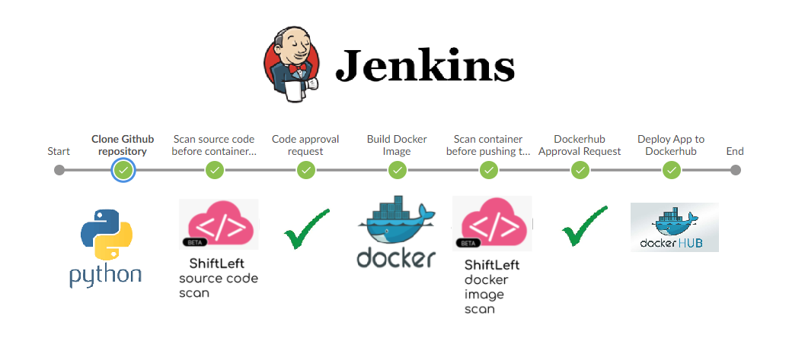
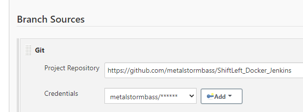
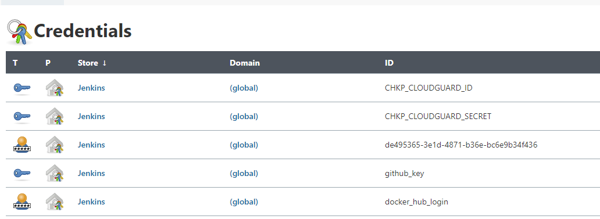
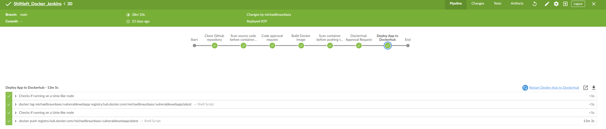

# Integrating Shift Left in a Jenkins Workflow

This document outlines how to implement Shift Left Security into a Jenkins Workflow. In this example, we start with my [Vulnerable Web App](https://github.com/metalstormbass/VulnerableWebApp) code. From there, the pipeline will scan the code, containerize the application and then scan the container. The user is then prompted to approve the pipeline stage if there is a vulnerability found. Here is a high level logical diagram of what is happening: <br>

 

<b> Fork this repository to get started!</b>

## Prerequisites

[Check Point Cloud Security Posture Management](https://secure.dome9.com/v2/login)<br> 
[Docker Hub](https://hub.docker.com/)<br>
[Jenkins](https://www.jenkins.io/)<br>

## Configure Jenkins Environment

First, install the [Blue Ocean](https://plugins.jenkins.io/blueocean/) plugin for Jenkins. This is a much better way of visualizing the pipeline. <br><br>

Create a Multibranch pipeline. Configure the project Branch Source to your Github project.

 
<br>
Then, insert the relevant credentials:
<br>
 


## Jenkinsfile

Let's examine the [Jenkinsfile](Jenkinsfile). The first step is to define the environment:

```

pipeline {
      agent any
      environment {
           CHKP_CLOUDGUARD_ID = credentials("CHKP_CLOUDGUARD_ID")
           CHKP_CLOUDGUARD_SECRET = credentials("CHKP_CLOUDGUARD_SECRET")
           SG_CLIENT_ID = credentials("SG_CLIENT_ID")
           SG_SECRET_KEY = credentials("SG_SECRET_KEY")
        }
        
  stages {
          
         stage('Clone Github repository') {
            
    
           steps {
              
             checkout scm
           
             }
  
          }
```

Once the environment is configured and the sourcecode is downloaded, we can begin scanning the code. The following instructions tell Jenkins to scan the code with Shift Left and then prompt the user for approval to move to the next stage should there be an error.

```
  stage('Scan source code before containerizing App') {    
           
            steps {
             script {      
              try {
                    sh 'chmod +x shiftleft' 
                    sh './shiftleft code-scan -s .'
              }    catch (Exception e) {
    
                 echo "Security Test Failed" 
                 env.flagError = "true"  
                  }
            }
      }
    }
  stage('Code approval request') {
      when{
            expression { env.flagError == "true" }
        }
           steps {
             script {
               def userInput = input(id: 'confirm', message: 'This code contains vulnerabilities. Would you still like to continue?', parameters: [ [$class: 'BooleanParameterDefinition', defaultValue: false, description: 'Approve Code to Proceed', name: 'approve'] ])
               env.flagError = "false"  
              }
                
            }
          }
```

The next stage is to scan the container and again approve the changes:

```
 stage('Build Docker Image') {    
           
            steps {
             script {      
           
                    app = docker.build("michaelbraunbass/vulnerablewebapp") 
                  
                    }
      } 
   }
  stage('Scan container before pushing to Dockerhub') {    
           
            steps {
             script {      
              try {
                    sh 'docker save michaelbraunbass/vulnerablewebapp -o vwa.tar' 
                    sh './shiftleft image-scan -i ./vwa.tar -t 1800'
              }    catch (Exception e) {
    
                 echo "Security Test Failed" 
                 env.flagError = "true"  
                  }
            }
      }
    }
```

Finally then we can push the container image to Dockerhub:


```
  stage('Dockerhub Approval Request') {
      when{
            expression { env.flagError == "true" }
        }
           steps {
             script {
               def userInput = input(id: 'confirm', message: 'This containers contains vulnerabilities. Push to Dockerhub?', parameters: [ [$class: 'BooleanParameterDefinition', defaultValue: false, description: 'Approve Code to Proceed', name: 'approve'] ])
              }
            }
          }   
     stage('Deploy App to Dockerhub') {
     
           steps {
             script {
                   docker.withRegistry('https://registry.hub.docker.com', 'docker_hub_login'){
                         app.push("latest")
              }
            }
          }              
     }
```

## Reviewing the Pipeline

Open up Blue Ocean and run the pipeline. A completed pipeline will look like this:




## Final Thoughts

This is a framework that you can include in your pipeline. It provides guardrails for the developers without interfering with their process.

